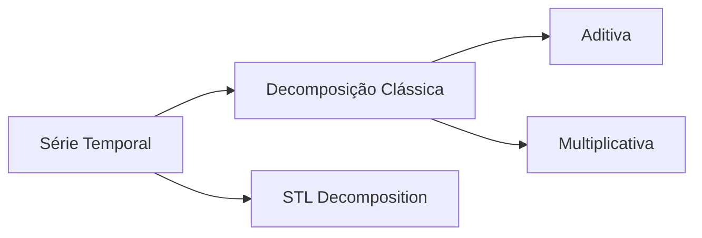

# 📈 Exercícios de Séries Temporais

Repositório contendo exercícios práticos e materiais de estudo da disciplina de **Análise e Previsão de Séries Temporais**.

## 🔍 Visão Geral

Este projeto reúne implementações de técnicas fundamentais para análise e previsão de séries temporais - sequências de dados indexadas temporalmente com aplicações em diversas áreas como:

- 📊 Finanças e Economia
- 🌦️ Meteorologia
- 🏭 Gestão de Operações
- 💧 Gestão de Recursos Naturais

## 🎯 Objetivos de Aprendizado

### Habilidades Desenvolvidas
✔️ Realizar análise exploratória de séries temporais  
✔️ Selecionar e aplicar modelos preditivos adequados  
✔️ Avaliar desempenho de modelos de previsão  
✔️ Implementar soluções em **R** e **Python**  
✔️ Documentar análises com **RMarkdown**

### Competências Técnicas
◻ Componentes de séries temporais (tendência, sazonalidade)  
◻ Métricas de erro e validação de modelos  
◻ Diagnóstico de resíduos e autocorrelação  
◻ Transformações para estacionariedade  

## 📚 Conteúdo Programático

### 1. Fundamentos
- Representação gráfica e componentes temporais
- Autocorrelação (FAC) e testes (Ljung-Box)
- Transformação de Box-Cox e normalização

### 2. Decomposição


### 3. Técnicas de Previsão
- Métodos ingênuos (Naive, Seasonal Naive)
- Alisamento exponencial (Holt-Winters)
- Modelos ARIMA/SARIMA

### 4. Validação
- Métricas: MAE, RMSE, MASE
- Diagnóstico de resíduos
- Intervalos de previsão

## ⚙️ Configuração do Ambiente

### Pré-requisitos
- Python 3.8+ ou R 4.0+
- Pacotes essenciais:
  ```bash
  # Python
  pip install statsmodels pandas numpy matplotlib seaborn
  
  # R
  install.packages(c("forecast", "tseries", "ggplot2"))
  ```

### Execução
1. Clone o repositório:
   ```bash
   git clone https://github.com/seu-usuario/series-temporais.git
   ```
2. Instale as dependências
3. Explore os notebooks por tópico:
   - `/notebooks/1-exploratorio.ipynb`
   - `/scripts/2-decomposicao.R`

## 📌 Exemplo Prático
```python
# Previsão com Holt-Winters
from statsmodels.tsa.holtwinters import ExponentialSmoothing

model = ExponentialSmoothing(serie, trend='add', seasonal='mul')
results = model.fit()
forecast = results.forecast(12)
```
